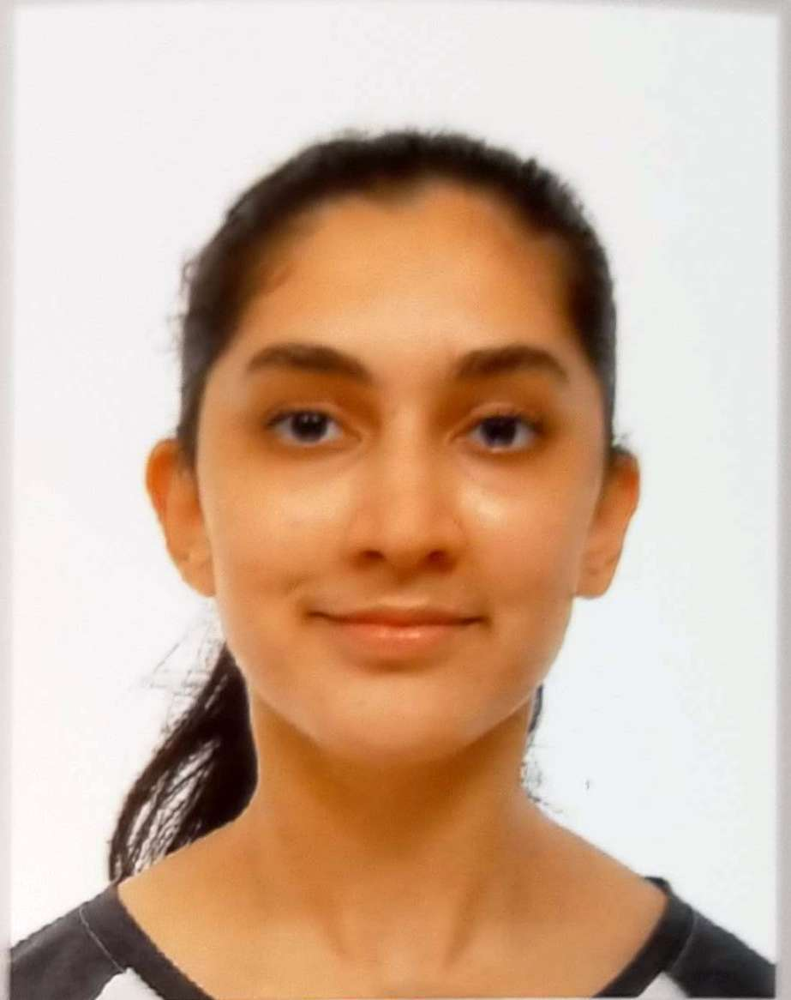
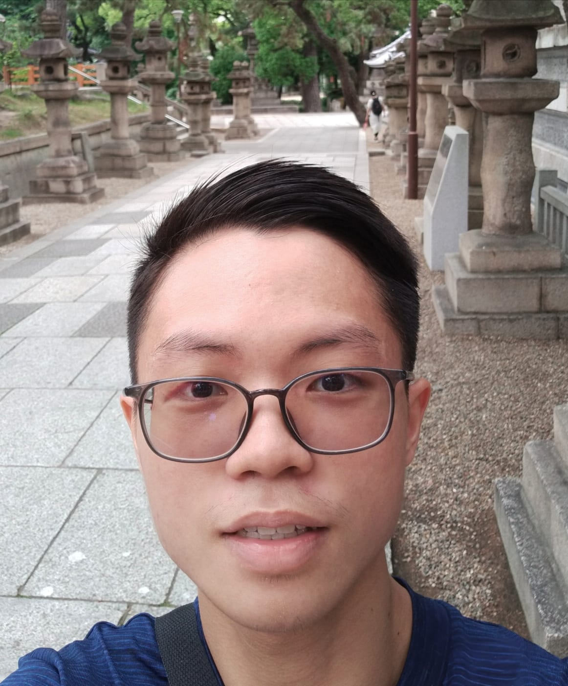

# About Us

We are a team based in the [School of Computing, National University of Singapore](http://www.comp.nus.edu.sg).

You can reach us at the email `seer[at]comp.nus.edu.sg`

## Project team

### Karthika Warrier

[[homepage](http://www.comp.nus.edu.sg/~damithch)]
[[github](https://github.com/karthu0301)]
[[portfolio](team/karthu0301.md)]

* Role: Teammate

### Koh Yu Sheng

[[github](http://github.com/noahkoh)]
[[portfolio](team/noahkoh.md)]

* Role: Teammate
* Responsibilities: Logic

### Zack Low Zong Yun

[[github](http://github.com/zacklow28)] [[portfolio](team/zacklow28.md)]

* Role: Teammate
* Responsibilities: Data

### Jean Doe

[[github](http://github.com/johndoe)]
[[portfolio](team/johndoe.md)]

* Role: Developer
* Responsibilities: Dev Ops + Threading

### James Doe

[[github](http://github.com/johndoe)]
[[portfolio](team/johndoe.md)]

* Role: Developer
* Responsibilities: UI
