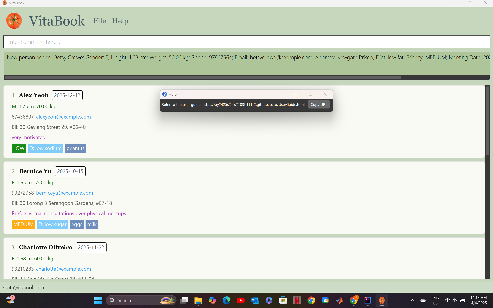
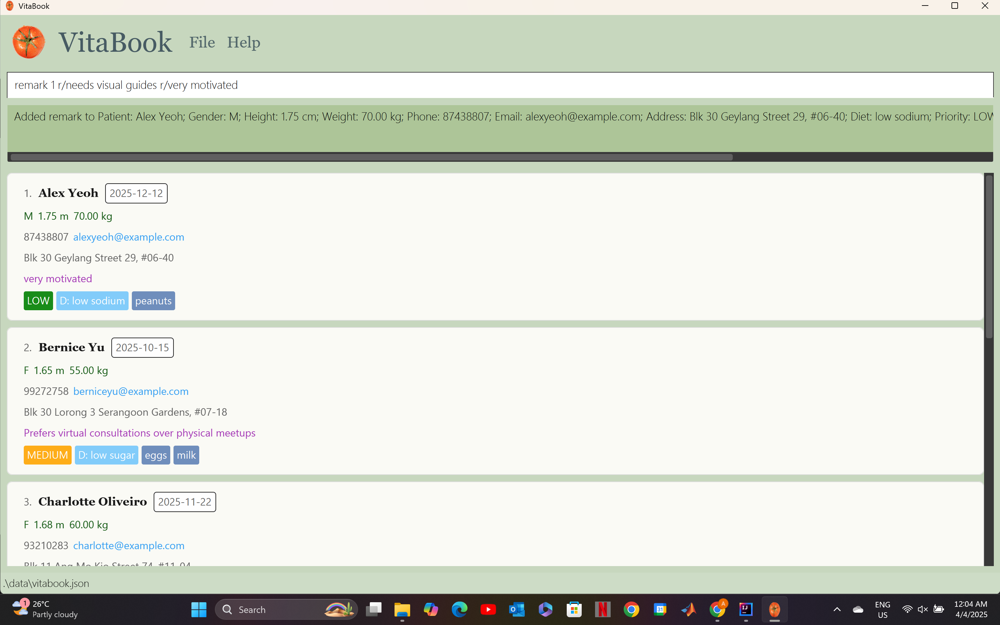
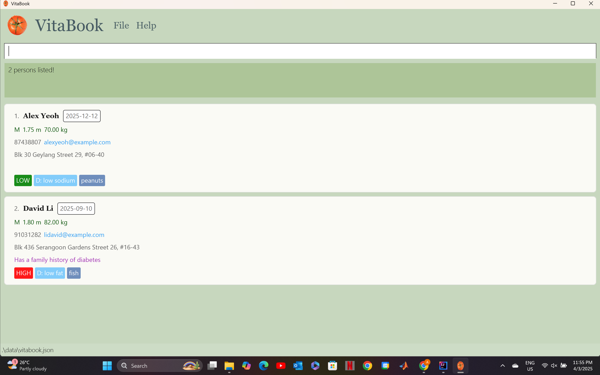

# VitaBook User Guide

**VitaBook** is a **desktop application for freelance nutritionists** to manage patient profiles, dietary information, and follow-ups efficiently. It combines the speed of a **Command Line Interface (CLI)** with the ease of a **Graphical User Interface (GUI)** to support fast and accurate data entry, retrieval, and updates.

<page-nav-print />
<!-- * Table of Contents -->
<page-nav-print />

--------------------------------------------------------------------------------------------------------------------

## Quick start

1. Ensure you have Java `17` or above installed in your Computer. 
   **Mac users:** Ensure you have the precise JDK version prescribed [here](https://se-education.org/guides/tutorials/javaInstallationMac.html).

1. Download the latest `.jar` file from [here](https://github.com/AY2425S2-CS2103T-F11-2/tp/releases).

1. Copy the file to the folder you want to use as the _home folder_ for your VitaBook.

1. Open a command terminal, `cd` into the folder you put the jar file in, and use the `java -jar addressbook.jar` command to run the application. 
   A GUI similar to the below should appear in a few seconds. Note how the app contains some sample data. 
   

1. Type the command in the command box and press Enter to execute it. e.g. typing **`help`** and pressing Enter will open the help window. 
   Some example commands you can try:

   * `list` : Lists all patients.

   * `add n/John Doe g/m h/1.78 w/70 no/98765432 e/johnd@example.com a/John Street, block 123, #01-01 d/low sodium m/2025-01-25 pr/low` : Adds a new patient named `John Doe` to the VitaBook.

   * `delete 3` : Deletes the 3rd contact shown in the current list.

   * `clear` : Deletes all contacts.

   * `exit` : Exits the app.

1. Refer to the [Features](#features) below for details of each command.

--------------------------------------------------------------------------------------------------------------------

## Features

<box type="info" seamless>

**Notes about the command format:** 

* Command keywords are case-sensitive. 
  e.g. `delete 1` is a known command, while `Delete 1` is an unknown command.

* Words in `UPPER_CASE` are the parameters to be supplied by the user. 
  e.g. in `add n/NAME`, `NAME` is a parameter which can be used as `add n/John Doe`.

* Items in square brackets are optional. 
  e.g `n/NAME [al/ALLERGY]` can be used as `n/John Doe al/friend` or as `n/John Doe`.

* Items with `…`​ after them can be used multiple times including zero times. 
  e.g. `[al/ALLERGY]…​` can be used as ` ` (i.e. 0 times), `al/milk`, `al/milk al/peanut` etc.

* Parameters can be in any order. 
  e.g. if the command specifies `n/NAME no/PHONE`, `no/PHONE n/NAME` is also acceptable.

* Extraneous parameters for commands that do not take in parameters (such as `help`, `list`, `exit` and `clear`) will be ignored. 
  e.g. if the command specifies `help 123`, it will be interpreted as `help`.

* If you are using a PDF version of this document, be careful when copying and pasting commands that span multiple lines as space characters surrounding line-breaks may be omitted when copied over to the application.
</box>

### Viewing help : `help`

Shows a message explaining how to access the help page.

Format: `help`

### Adding a patient: `add`

Adds a new patient to VitaBook with its personal details.

Format: `n/NAME g/GENDER h/HEIGHT w/WEIGHT no/PHONE e/EMAIL a/ADDRESS d/DIET pr/PRIORITY m/MEETING_DATE [al/ALLERGY]…​`

<box type="tip" seamless>

* Emails must be unique i.e. duplicate emails are not allowed.
* Patient names can be duplicated i.e. duplicate names are allowed.

**Tip:** A patient can have any number of allergies (including 0)
</box>

Examples:
* `add n/John Doe g/m h/1.78 w/70 no/98765432 e/johnd@example.com a/John Street, block 123, #01-01 d/low sodium m/2025-01-25 pr/low`
* `add n/Betsy Crowe al/milk e/betsycrowe@example.com g/f a/Newgate Prison h/1.68 w/50 no/97867564 d/low fat al/peanuts m/2025-02-24 pr/medium`

### Listing all patients : `list`

Shows a list of all patients in VitaBook.

Format: `list`

### Editing a patient : `edit`

Edits an existing patient in VitaBook.

Format: `edit INDEX [n/NAME] [p/PHONE] [e/EMAIL] [a/ADDRESS] [al/ALLERGY]…​`

* Edits the patient at the specified `INDEX`. The index refers to the index number shown in the displayed patient list. The index **must be a positive integer** 1, 2, 3, …​
* At least one field to edit must be provided.
* Existing values will be updated to the input values.
* When editing allergies, the existing allergies of the patient will be removed i.e. adding of allergies is not cumulative.
* You can remove all the patient’s allergies by typing `al/` without
    specifying any allergies after it.

Examples:
*  `edit 1 no/91234567 e/johndoe@example.com` Edits the phone number and email address of the 1st patient (in the list) to be `91234567` and `johndoe@example.com` respectively.
*  `edit 2 n/Betsy Crower al/` Edits the name of the 2nd patient (in the list) to be `Betsy Crower` and clears all existing allergies.

### Add a remark to a patient: `remark`

Adds a new remark or replaces an existing remark of a patient.

Format: `remark INDEX r/[REMARK]`

* Adds a new remark or replaces an existing remark to the patient at the specified `INDEX`. The index refers to the index number shown in the displayed patient list. The index **must be a positive integer** 1, 2, 3, …​
* You can remove a patient's remark by typing `r/` without specifying any remarks after it. 
* You can add exactly one remark to a patient. e.g. `remark 1 r/needs visual guides r/very motivated` will result in only `very motivated` as a remark to the specified patient.
  

Examples:
* `list` followed by `remark 2 r/Enjoyed last week's meal plan, keep similar items` adds a remark to the 2nd patient in the patient list.
* `find Betsy` followed by `remark 1 r/Tends to skip meals when stressed` adds a remark to the 1st patient in the results list of the `find` command.
* `remark 3 r/` removes existing remark to the 3rd patient in the list.

### Locating patients by name: `find`

Finds patients whose names contain any of the given keywords.

Format: `find KEYWORD [MORE_KEYWORDS]`

* The search is case-insensitive. e.g `hans` will match `Hans`
* The order of the keywords does not matter. e.g. `Hans Bo` will match `Bo Hans`
* Only the name is searched.
* Only full words will be matched e.g. `Han` will not match `Hans`
* Patients matching at least one keyword will be returned (i.e. `OR` search).
  e.g. `Hans Bo` will return `Hans Gruber`, `Bo Yang`

Examples:
* `find John` returns `john` and `John Doe`
* `find alex david` returns `Alex Yeoh`, `David Li` 
  

### Filtering patients: `filter`

Filter patient entries based on either priority or diet.

Format: `filter pr/PRIORITY` or `filter d/DIET`

Examples:
* `filter pr/high` returns all patient entries with high priority.
* `filter d/low sugar` returns all patient entries with low sugar diet.

### Sorting patients: `sort`

Sorts patient entries based on specific criteria (priority, name, diet).

Format: `sort priority` or `sort name` or `sort diet`

* `sort priority` sorts patients from high priority to low priority. 
* `sort name` sorts patients in lexicographical (alphabetical) order by name in ascending order.
* `sort diet` sorts patients in lexicographical (alphabetical) order by diet in ascending order.

### Deleting a patient : `delete`

Deletes the specified patient from VitaBook.

Format: `delete INDEX` or `delete EMAIL`

* Deletes the patient at the specified `INDEX`.
* Alternatively, deletes the patient with a specified `EMAIL`.
* The index refers to the index number shown in the displayed patient list.
* The index **must be a positive integer** 1, 2, 3, …​

Examples:
* `list` followed by `delete 2` deletes the 2nd patient in the patient list.
* `find Betsy` followed by `delete 1` deletes the 1st patient in the results list of the `find` command.
* `delete johnd@example.com` deletes the patient with email address `johnd@example.com`.

### Command History Navigation

Use up and down arrow keys to navigate previously entered commands.

### Light Mode and Dark Mode

Transition between light mode and dark mode by for a more customisable and improved visual experience.

* Click `File` → `Dark Mode` : for transition from light mode to dark mode.
* Click `File` → `Light Mode` : for transition from dark mode to light mode.

### Clearing all entries : `clear`

Clears all patient entries from VitaBook.

Format: `clear`

### Exiting the program : `exit`

Exits the program.

Format: `exit`

### Saving the data

VitaBook data are saved in the hard disk automatically after any command that changes the data. There is no need to save manually.

### Editing the data file

VitaBook data are saved automatically as a JSON file `[JAR file location]/data/vitabook.json`. Advanced users are welcome to update data directly by editing that data file.

<box type="warning" seamless>

**Caution:**
If your changes to the data file makes its format invalid, VitaBook will discard all data and start with an empty data file at the next run.  Hence, it is recommended to take a backup of the file before editing it. 
Furthermore, certain edits can cause the VitaBook to behave in unexpected ways (e.g., if a value entered is outside the acceptable range). Therefore, edit the data file only if you are confident that you can update it correctly.
</box>

## FAQ

**Q**: How do I transfer my data to another Computer? 
**A**: Install the app in the other computer and overwrite the empty data file it creates with the file that contains the data of your previous AddressBook home folder.

--------------------------------------------------------------------------------------------------------------------

## Known issues

1. **When using multiple screens**, if you move the application to a secondary screen, and later switch to using only the primary screen, the GUI will open off-screen. The remedy is to delete the `preferences.json` file created by the application before running the application again.
2. **If you minimize the Help Window** and then run the `help` command (or use the `Help` menu, or the keyboard shortcut `F1`) again, the original Help Window will remain minimized, and no new Help Window will appear. The remedy is to manually restore the minimized Help Window.

--------------------------------------------------------------------------------------------------------------------

## Command summary

Action     | Format, Examples
-----------|----------------------------------------------------------------------------------------------------------------------------------------------------------------------
**Add**    | `add n/NAME p/PHONE_NUMBER e/EMAIL a/ADDRESS [al/ALLERGY]…​`   e.g., `add n/James Ho p/22224444 e/jamesho@example.com a/123, Clementi Rd, 1234665 t/friend t/colleague`
**Clear**  | `clear`
**Delete** | `delete INDEX`  e.g., `delete 3`
**Edit**   | `edit INDEX [n/NAME] [p/PHONE_NUMBER] [e/EMAIL] [a/ADDRESS] [al/ALLERGY]…​`  e.g.,`edit 2 n/James Lee e/jameslee@example.com`
**Find**   | `find KEYWORD [MORE_KEYWORDS]`  e.g., `find James Jake`
**List**   | `list`
**Help**   | `help`
