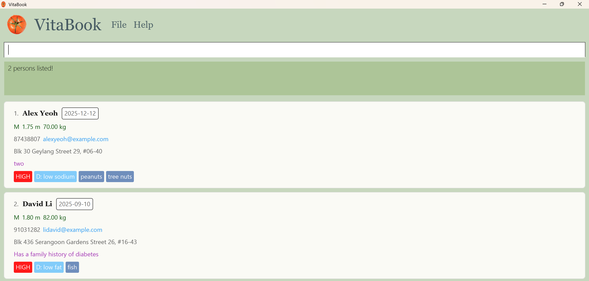
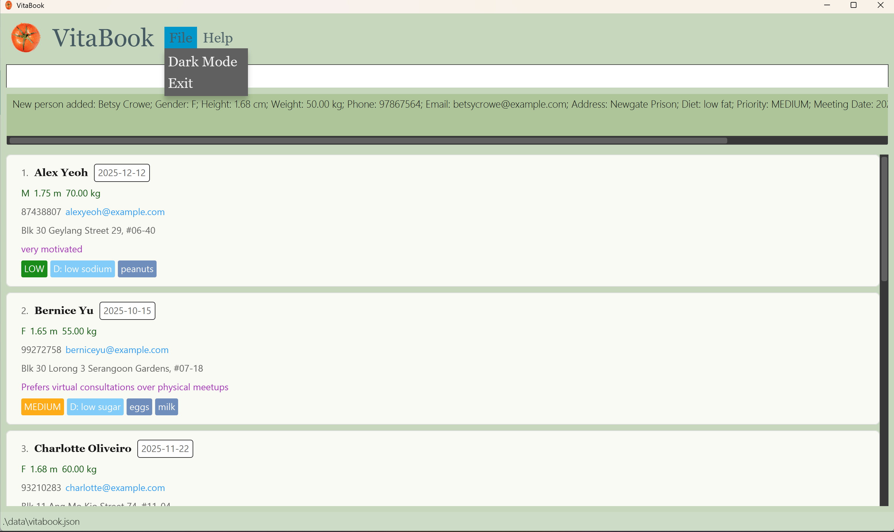

# 🍅 VitaBook User Guide 🍅

Welcome to **VitaBook** — your go-to desktop companion made just for **freelance nutritionists in Singapore**. Whether you're juggling patient records, planning meal guides, or sorting through dietary preferences, VitaBook’s got your back. It blends the speed of a **Command Line Interface (CLI)** with the simplicity of a **Graphical User Interface (GUI)**, so you can breeze through admin work and get back to what you do best: helping people eat better and live healthier.

### Table of Contents 📚

#### [1. Introduction](#1-introduction-2)
- [1.1 How to use User Guide?](#1-1-how-to-use-user-guide)
- [1.2 How to use VitaBook?](#1-2-how-to-use-vitabook)
- [1.3 Quick Start](#1-3-quick-start)
- [1.4 Instructions about Commands](#1-4-instructions-about-commands)

#### [2. Features](#2-features-2)

##### [2.1 To Navigate Patient Care](#2-1-to-help-you-navigate-patient-care)
- [2.1.1 Adding a Patient](#2-1-1-adding-a-patient-add)
- [2.1.2 Listing all Patients](#2-1-2-listing-all-patients-list)
- [2.1.3 Editing a Patient](#2-1-3-editing-a-patient-edit)
- [2.1.4 Changing a Patient's Priority](#2-1-4-changing-a-patient-s-priority-priority)
- [2.1.5 Adding a Remark to a Patient](#2-1-5-adding-a-remark-to-a-patient-remark)
- [2.1.6 Locating Patients by Name](#2-1-6-locating-patients-by-name-find)
- [2.1.7 Filtering Patients](#2-1-7-filtering-patients-filter)
- [2.1.8 Sorting Patients](#2-1-8-sorting-patients-sort)
- [2.1.9 Deleting a Patient](#2-1-9-deleting-a-patient-delete)
- [2.1.10 Clearing all Patient Entries](#2-1-10-clearing-all-patient-entries-clear)

##### [2.2 To Provide a Convenient and Pleasant Experience](#2-2-to-provide-a-convenient-and-pleasant-experience-2)
- [2.2.1 Viewing Help](#2-2-1-viewing-help-help)
- [2.2.2 Undoing the Last Change](#2-2-2-undoing-the-last-change-undo)
- [2.2.3 Redoing the Last Undo](#2-2-3-redoing-the-last-undo-redo)
- [2.2.4 Navigating Through Command History](#2-2-4-navigating-through-command-history-and)
- [2.2.5 Toggling between Light Mode and Dark Mode](#2-2-5-toggling-between-light-mode-and-dark-mode)
- [2.2.6 Exiting the Program](#2-2-6-exiting-the-program-exit)
- [2.2.7 Saving the Data](#2-2-7-saving-the-data)

##### [2.3 Bonus for Advanced Nutritionists](#2-3-bonus-for-advanced-nutritionists-2)
- [2.3.1 Edit the Data File Directly](#2-3-1-editing-the-data-file-directly)

##### [3. FAQ](#3-faq-2)

##### [4. Known Issues](#4-known-issues-2)

##### [5. Command Summary](#5-command-summary-2)

##### [6. Glossary](#6-glossary-2)

##### [7. Java Setup Instructions](#7-java-setup-instructions-2)

--------------------------------------------------------------------------------------------------------------------

## 1. Introduction

### 1.1 How to use User Guide? 📘

This guide is here to help you make the most of **VitaBook** — whether you're a first-time user or a seasoned pro.

- 🆕 **First time here?**
  Start with the [Quick Start](#1-3-quick-start) and [Key Features](#key-features) sections to get an overview of what VitaBook offers.

- 🔍 **Need a specific command?**
  Use the [Command Summary](#5-command-summary-2) or [Table of Contents](#table-of-contents) to quickly find what you need.

- ✨ **Want to learn a feature in depth?**
  Browse the [Features](#2-features-2) section — each command is explained with examples.

- 🛠️ **Facing issues or bugs?**
  Check the [FAQ](#3-faq-2) and [Known Issues](#4-known-issues-2) sections for help and common solutions.

- ⚙️ **Power user?**
  Learn how to directly edit the data file in [Edit the Data File Directly!](#2-3-1-editing-the-data-file-directly)

Feel free to jump around or read it cover to cover — whatever suits your workflow.  
Let VitaBook do the admin work, so you can focus on what matters most. 🧠🍎


### 1.2 How to use VitaBook? 🧭

VitaBook is built just for you, nutritionists — with commands tailored to your daily workflow. From adding and editing patient records to sorting, filtering, and setting priorities, everything is designed to help you stay organised, focused, and in control of your care delivery.

#### Key Features ⭐

- **[Add Patient](#2-1-1-adding-a-patient-add)** — `add` : Quickly create a new patient entry with all their key info.
- **[Edit Patient](#2-1-3-editing-a-patient-edit)** — `edit` : Update patient details as their care evolves.
- **[Priority](#2-1-4-changing-a-patient-s-priority-priority)** — `priority` : Reprioritise patients based on urgency or attention needed.
- **[Filter](#2-1-7-filtering-patients-filter)** — `filter` : Narrow down your list by priority, diet, gender, or meeting date.
- **[Sort](#2-1-8-sorting-patients-sort)** — `sort` : Instantly organise patients by what matters most — priority, name, or diet.

[↓ Go to Command Summary for Quick Reference!](#5-command-summary-2)

### 1.3 Quick start 🚀

Let us guide you through your start with VitaBook:

1. Ensure you have Java `17` or above installed in your computer.<br>
   **Mac users:** Ensure you have the precise JDK version prescribed [here](https://se-education.org/guides/tutorials/javaInstallationMac.html).<br>
   **Check/Install Java:** See [Java Setup Instructions](#7-java-setup-instructions-2) at the bottom of this guide.

2. Download the latest `.jar` file [here](https://github.com/AY2425S2-CS2103T-F11-2/tp/releases)!

3. Copy the file to the folder you want to use as the _home folder_ for your own VitaBook.

4. Open a command terminal and use the `cd` command to navigate to the folder containing the `.jar` file.

5. Type the command `java -jar vitabook.jar` to run the application. A GUI similar to the one below should appear in a few seconds. Note that the app contains some sample data.<br>

<a href="images/Ui.png">


</a>

*Figure 1: The VitaBook UI, showing layout and sample data*<br>

6. Try typing the command in the command box and press *Enter* to execute it.<br>
   e.g. typing `help` and pressing *Enter* will open the help window. Let's try some out!:

<p style="padding-left: 20px">

* `list` : Lists all patients.

* `add n/John Doe g/m h/1.78 w/70.00 no/98765432 e/johnd@example.com a/John Street, block 123, #01-01 d/low sodium m/2025-01-25 pr/LOW` : Adds a new patient named `John Doe` to your VitaBook.

* `delete 3` : Deletes the 3rd patient in the current list.

* `clear` : Deletes all patients.

* `exit` : Exits the app.
</p>

7. Were these commands fun to play with? Feel free to explore further the functionalities of VitaBook by following [Features](#2-features-2)!

### 1.4 Instructions about Commands 🧾

These are a few things to take note while exploring VitaBook!

1. Command keywords are **case-sensitive**.<br>
   e.g. `delete 1` is a known command, while `Delete 1` is an unknown command.


2. Words that are in `UPPER_CASE` are the parameters to be supplied by the nutritionist, you!<br>
   e.g. in `add n/NAME`, `NAME` is a parameter which you can fill in as `add n/John Doe`.


3. Items in square brackets are **optional**.<br>
   e.g `n/NAME [al/ALLERGY]` mean you can either have allergy or not such as `n/John Doe al/fish` or as `n/John Doe`. After all, not everybody has allergies, do they?


4. Items with `…`​ after them can be used multiple times including zero times.<br>
   e.g. `[al/ALLERGY]…​` can be used as ` ` (i.e. 0 times), `al/milk`, `al/milk al/peanut` etc. This makes your entry of each patient more comprehensive!


5. Parameters for `add` and `edit` commands can be in any order.<br>
   e.g. if the command specifies `n/NAME no/PHONE`, `no/PHONE n/NAME` is also acceptable, making the system flexible.


6. Extraneous parameters for commands that do not take in parameters (i.e. `help`, `list`, `exit`, `undo`, `redo` and `clear`) will be ignored.<br>
   e.g. if the command specifies `help 123`, it will be interpreted as `help` so as to make your experience convenient!


7. If you are using a PDF version of this document, be careful when copying and pasting commands that span multiple lines as space characters surrounding line-breaks may be omitted when copied over to the application.

[↑ Back to Top](#vitabook-user-guide)<br>
[↑ Back to Table of Contents](#table-of-contents)<br>

--------------------------------------------------------------------------------------------------------------------

## 2. Features

### 2.1 To Help You Navigate Patient Care 

#### 2.1.1 Adding a Patient: `add` ➕

Adds a new patient to your VitaBook with their specified/required fields.

Format: `add n/NAME g/GENDER h/HEIGHT w/WEIGHT no/PHONE e/EMAIL a/ADDRESS d/DIET pr/PRIORITY m/MEETING_DATE [al/ALLERGY]…​`

<a href="images/Ui.png">


</a>

*Figure 2: Example of person card, containing different fields*<br>

<box type="note" seamless>

**To note:**
1. A patient can have any number of allergies (including 0).

2. Emails must be unique i.e. duplicate emails are not allowed.

3. Patient names can be duplicated i.e. duplicate names are allowed.

4. Gender must be `m` or `f` (case-insensitive).

5. Height must be between `0.50` and `3.00`.

6. Weight (in kilograms) must be a positive number with **exactly** 2 decimal places, strictly greater than 0.00 and less than or equal to 1000.00.

7. Priority must be one of the following: `high`, `medium`, `low` (case-insensitive).

8. Diet must be one of the following: `regular`, `low sodium`, `low fat`, `low carb`, `low sugar` (case-insensitive).

9. Meeting date must be in the format `YYYY-MM-DD`.

10. Phone number must be a positive integer of **exactly** 8 digits and starts with 6, 8 or 9.
</box>

Examples:
* `add n/John Doe g/m h/1.78 w/70.00 no/98765432 e/johnd@example.com a/John Street block 123, #01-01 d/low sodium pr/LOW m/2025-01-25`
* `add n/Betsy Crowe e/betsycrowe@example.com g/f a/Newgate Prison h/1.68 w/50.00 no/97867564 d/low fat pr/MEDIUM m/2025-02-24 al/peanuts al/milk`

---

#### 2.1.2 Listing all Patients: `list` 📋

Shows a list of all the patients in your VitaBook.
If you have previously used `filter` or `find` to narrow down the patient list, use the `list` command to reset the display and show all patients again.

Format: `list`

---

#### 2.1.3 Editing a Patient: `edit` ✏️

Edits the specified fields of an existing patient in your VitaBook.

Format: `edit INDEX [n/NAME] [g/GENDER] [h/HEIGHT] [w/WEIGHT] [no/PHONE] [e/EMAIL] [a/ADDRESS] [d/DIET] [pr/PRIORITY] [m/MEETING_DATE] [al/ALLERGY]…`

<box type="note" seamless>

**To note:**
1. The index refers to the index number shown in the displayed patient list. The index **must be a positive integer**.

2. At least one field to edit must be provided.

3. Existing values will be updated to the input values.

4. You can remove all the patient’s allergies by typing `al/` without specifying any allergies after it.

5. The fields used in the `edit` command follow the same constraints as specified in the `add` command.
</box>

Examples:
*  `edit 1 no/91234567 e/johndoe@example.com` Edits the phone number and email address of the 1st patient (in the list) to be `91234567` and `johndoe@example.com` respectively.
*  `edit 2 n/Betsy Crower al/` Edits the name of the 2nd patient (in the list) to be `Betsy Crower` and clears all existing allergies.

<box type="warning" seamless>

**Warning:**
When editing allergies, the existing allergies will be replaced by the new ones you provide. To ensure that the old allergies are not deleted, make sure to include them in the `edit` command.
</box>

---

#### 2.1.4 Changing a Patient's Priority: `priority` 🔺

Changes a patient's priority by their index.

Format: `priority INDEX pr/PRIORITY`

<box type="note" seamless>

**To note:**
1. The index refers to the index number shown in the displayed patient list. The index **must be a positive integer**.

2. Priority must be one of the following: `high`, `medium`, `low` (case-insensitive) and cannot be blank.
</box>

Example:
* `priority 1 pr/HIGH` changes the priority of the 1st patient in the patient list to `HIGH`.

---

#### 2.1.5 Adding a Remark to a Patient: `remark` 💬

Adds a new remark or replaces an existing remark of a patient.

Format: `remark INDEX r/[REMARK]`

<box type="note" seamless>

**To note:**
1. You can use this command to add any conditions or custom information.

2. The index refers to the index number shown in the displayed patient list. The index **must be a positive integer**.

3. You can remove a patient's remark by typing `r/` without specifying any remarks after it.

4. You can add or edit exactly one remark for each patient.<br>
e.g. `remark 1 r/needs visual guides r/very motivated` will result in an error message being thrown.
</box>

<a href="images/multipleRemarksResult.png">


</a>

*Figure 3: Result when adding multiple remarks to a patient using `remark 1 r/one r/two`*

Examples:
* `list` followed by `remark 2 r/Enjoyed last week's meal plan, keep similar items` adds a remark to the 2nd patient in the patient list.
* `find Betsy` followed by `remark 1 r/Tends to skip meals when stressed` adds a remark to the 1st patient in the results list of the `find` command.
* `remark 3 r/` removes existing remark to the 3rd patient in the list.

<box type="warning" seamless>

**Warning:**
Remark command currently only supports adding a new remark or replacing an existing one. Thus, currently at most one remark can be displayed for each patient. Older remarks will be overwritten if you wish to add a new remark.
</box>

---

#### 2.1.6 Locating Patients by Name: `find` 🔍

Finds patients whose names contain *any* of the given **keywords**.

Format: `find KEYWORD [MORE_KEYWORDS]`

<box type="note" seamless>

**To note:**
1. The search is case-insensitive.<br>
e.g `hans` will match `Hans`

2. The order of the keywords does not matter.<br>
e.g. `Hans Bo` will match `Bo Hans`

3. Only the name is searched.

4. Only full words will be matched.<br>
e.g. `Han` will not match `Hans`

5. Patients whose name matches any of the given keywords will be returned (i.e. `OR` search).<br>
e.g. `Hans Bo` will return `Hans Gruber`, `Bo Yang`
</box>

Examples:
* `find John` returns `john` and `John Doe`
* `find alex david` returns `Alex Yeoh`, `David Li`<br>

<a href="images/findAlexDavidResult.png">


</a>

*Figure 4: Results for `find alex david`*

---

#### 2.1.7 Filtering Patients: `filter` 🧃

Filter patients based on a field (priority, diet, gender, meeting date).

Format: `filter pr/PRIORITY` or `filter d/DIET` or `filter g/GENDER` or `filter m/MEETING_DATE`

<box type="note" seamless>

**To note:**
1. At least one field to filter must be provided.

2. The fields used in the `filter` command follows the same constraints as specified in the `add` command.
</box>

Examples:
* `filter pr/HIGH` returns all patients with high priority.
* `filter d/low sugar` returns all patients with low sugar diet.
* `filter g/f` returns all female patients.
* `filter m/2025-12-12` returns all patients with meeting date on `2025-12-12`.

---

#### 2.1.8 Sorting Patients: `sort` 📊

Sorts patients based on specific criteria (priority, name, diet and meeting date).

Format: `sort CRITERIA`

<box type="note" seamless>

**To note:**
1. Criteria must be one of the following: `priority`, `name`, `diet`, `meetingdate` (case-insensitive) and cannot be blank.
</box>

Examples:
* `sort priority` returns the patient list sorted from the highest priority to the lowest priority.
* `sort name` returns the patient list sorted in lexicographical (alphabetical) order by name in ascending order.
* `sort diet` returns the patient list sorted in lexicographical (alphabetical) order by diet in ascending order.
* `sort meetingdate` returns the patient list sorted in chronological order by date from earliest to latest.

---

#### 2.1.9 Deleting a Patient: `delete` ❌

Deletes a patient from your VitaBook.

Format: `delete INDEX` or `delete EMAIL`

<box type="note" seamless>

**To note:**
1. You can choose to delete the patient at the specified `INDEX`.

2. Alternatively, you can also delete the patient with a specified `EMAIL`.

3. The index refers to the index number shown in the displayed patient list. The index **must be a positive integer**.
</box>

Examples:
* `list` followed by `delete 2` deletes the 2nd patient in the patient list.
* `find Betsy` followed by `delete 1` deletes the 1st patient in the results list of the `find` command.
* `delete johnd@example.com` deletes the patient with email address `johnd@example.com`.

---

#### 2.1.10 Clearing all Patient Entries: `clear` 🧹

Clears all patient entries from your VitaBook.

Format: `clear`

---

### 2.2 To Provide a Convenient and Pleasant Experience

#### 2.2.1 Viewing Help: `help` 🆘

Opens a window with a link to this user guide.

Format: `help`

<a href="images/helpMessage.png">


</a>

*Figure 5: Window displaying the user guide link*

---

#### 2.2.2 Undoing the Last Change: `undo` ↩️

Undoes the last command that changed the patient list.

Format: `undo`

<box type="note" seamless>

**To note:**
1. You can only undo for commands that changed the patient list (i.e. `add`, `edit`, `delete`, `remark`, `clear`, `priority`, `redo`).

2. Support multiple undo commands until the patient list reaches the initial state.
</box>

---

#### 2.2.3 Redoing the Last Undo: `redo` ↪️

Redoes the last undo.

Format: `redo`

<box type="note" seamless>

**To note:**
1. You can only redo if you executed an undo command.

2. Support multiple redo commands until the patient list reaches the final state.
</box>

<box type="warning" seamless>

**Warning:**
Executing a new command that changes the patient list (excluding `undo`) after undo commands will purge the redo history. This means you cannot redo those undo commands anymore.
</box>

---

#### 2.2.4 Navigating through Command History: `↑` and `↓` ⌨️

Navigates through the command history for quick access to previously executed commands.

Format: `↑` or `↓` arrow keys

---

#### 2.2.5 Toggling between Light Mode and Dark Mode 🌗

Transitions between light mode and dark mode for a more customisable and improved visual experience. Click the `File` menu to toggle between light mode and dark mode.

<a href="images/LightMode.png">


</a>

*Figure 6: Change from light mode to dark mode*

<a href="images/DarkMode.png">


</a>

*Figure 7: Change from dark mode to light mode*

---

#### 2.2.6 Exiting the Program: `exit` 🚪

Exits the program.

Format: `exit`

---

#### 2.2.7 Saving the Data 💾

Your VitaBook data is saved in the hard disk automatically after any command that modifies the data. There is no need to save manually.

---

### 2.3 Bonus for Advanced Nutritionists

#### 2.3.1 Editing the Data File Directly! 🧑‍💻

Your VitaBook data is saved automatically as a JSON file `[JAR file location]/data/vitabook.json`. Advanced users are welcome to update data directly by editing that data file.

<box type="warning" seamless>

**Warning:**
If your changes to the data file makes its format invalid, VitaBook will discard all data and start with an empty data file at the next run.  Hence, it is recommended to take a backup of the file before editing it.<br>
Furthermore, certain edits can cause the VitaBook to behave in unexpected ways (e.g., if a value entered is outside the acceptable range). Therefore, edit the data file only if you are confident that you can update it correctly.
</box>
<br>

[↑ Back to Top](#vitabook-user-guide)<br>
[↑ Back to Table of Contents](#table-of-contents)<br>

--------------------------------------------------------------------------------------------------------------------

## 3. FAQ ❓

**❓ Q: What is VitaBook?**  
**💬 A:** VitaBook is your digital notebook — a desktop app built for freelance nutritionists like you. It helps you manage patient info like diets, appointments, and notes quickly and easily, all through fast, simple typing. No WiFi? No problem — it works offline too!

---

**❓ Q: Who is VitaBook for?**  
**💬 A:** If you're a freelance or home-based nutritionist who wants to stay organised without juggling papers or complicated software, VitaBook is for you. It's lightweight, fast, and tailored to your day-to-day workflow.

---

**❓ Q: How is VitaBook different from a regular address book?**  
**💬 A:** While an address book gives you names and numbers, VitaBook gives you **real patient management**. You can track diets, allergies, meeting dates, notes, urgency (priority), and more — all in one place.

---

**❓ Q: Do I need to install anything special to use VitaBook?**  
**💬 A:** Just Java 17 — nothing fancy! Once you have that, you can launch VitaBook with a simple command and start managing your patients right away.

---

**❓ Q: What kind of info can I store about a patient?**  
**💬 A:** Everything you need: name, phone, email, address, gender, height, weight, diet, allergies, meeting date, priority level, and remarks. It’s like a one-stop record for every patient.

---

**❓ Q: What happens if I delete a patient by accident?**  
**💬 A:** No worries — just use the `undo` command to bring them back. VitaBook remembers your recent changes so you don’t have to stress.

---

**❓ Q: Can I undo other actions too?**  
**💬 A:** Yes! Whether it’s a delete, edit, or clear, the `undo` command has your back. You can even redo something if you changed your mind.

---

**❓ Q: Can I add custom info for patients?**  
**💬 A:** While you can't add new fields, the `remark` field is super flexible — use it to write anything extra you want to remember, like “prefers gluten-free snacks” or “has follow-up next month.”
<br>

[↑ Back to Top](#vitabook-user-guide)<br>
[↑ Back to Table of Contents](#table-of-contents)<br>

--------------------------------------------------------------------------------------------------------------------

## 4. Known Issues 🐞

- **Allergy fields are case-sensitive.**
  Adding allergies like `peanuts` and `Peanuts` results in two different allergies being stored. This can lead to duplicates or confusion when filtering/searching.

- **Allergy Validation is only alphanumeric.**
  User can enter any combination of letters and numbers, even if they don't represent actual allergies. This is because maintaining a complete list of all possible allergies is not feasible.

- **No support for recurring meeting dates or reminders.**
  Only a single meeting date can be stored per patient, with no repeat scheduling or notification support.

- **Commands must follow strict prefixes.**
  Forgetting a prefix (like `n/` for the name field) will result in an invalid command, even if the content is correct.

- **No concurrency or multi-user support.**
  VitaBook is designed as a single-user desktop application. Running two instances may cause file conflicts or data loss.

- **No graphical support for charts or health analytics.**
  Patient data is presented in text format only. Features like BMI calculation, graphs, or dashboards are not supported.

- **Application crashes if `vitabook.json` is manually corrupted.**
  If the user edits or corrupts the storage file manually, VitaBook may fail to start or load a blank state. To solve this issue, try deleting `vitabook.json` and rerunning the application. Remember to backup the file before deleting.
<br>

[↑ Back to Top](#vitabook-user-guide)<br>
[↑ Back to Table of Contents](#table-of-contents)<br>

-------------------------------------------------------------------------------------------------------------------
## 5. Command Summary 🗂️

| Action                        | Format, Examples                                                                                                                                                                                                                                     |
|-------------------------------|------------------------------------------------------------------------------------------------------------------------------------------------------------------------------------------------------------------------------------------------------|
| **Help**                      | `help`                                                                                                                                                                                                                                               |
| **Add**                       | `add n/NAME g/GENDER h/HEIGHT w/WEIGHT no/PHONE e/EMAIL a/ADDRESS d/DIET pr/PRIORITY m/MEETING_DATE [al/ALLERGY]…`<br>e.g., `add n/Alex Yeoh g/M h/1.75 w/70.00 no/87438807 e/alex@example.com a/Blk 30 d/low sodium pr/LOW m/2025-12-12 al/peanuts` |
| **List**                      | `list`                                                                                                                                                                                                                                               |
| **Edit**                      | `edit INDEX [n/NAME] [g/GENDER] [h/HEIGHT] [w/WEIGHT] [no/PHONE] [e/EMAIL] [a/ADDRESS] [d/DIET] [pr/PRIORITY] [m/MEETING_DATE] [al/ALLERGY]…`<br>e.g., `edit 1 d/low sugar w/68.00 pr/MEDIUM`                                                        |
| **Priority**                  | `priority INDEX pr/PRIORITY`<br>e.g., `priority 2 pr/HIGH`                                                                                                                                                                                           |
| **Remark**                    | `remark INDEX r/REMARK`<br>e.g., `remark 1 r/Likes protein-rich foods`                                                                                                                                                                               |
| **Find**                      | `find KEYWORD [MORE_KEYWORDS]`<br>e.g., `find Alex sugar`                                                                                                                                                                                            |
| **Filter**                    | `filter pr/PRIORITY` or `filter d/DIET`  or `filter g/GENDER` or `filter m/MEETING DATE` <br>e.g., `filter d/low sodium`                                                                                                                             |
| **Sort**                      | `sort CRITERIA `<br>e.g., `sort priority`                                                                                                                                                                                                            |
| **Delete**                    | `delete INDEX` or `delete EMAIL`<br>e.g., `delete 3` or `delete johnd@gmail.com`                                                                                                                                                                     |
| **Clear**                     | `clear`                                                                                                                                                                                                                                              |
| **Undo**                      | `undo`                                                                                                                                                                                                                                               |
| **Redo**                      | `redo`                                                                                                                                                                                                                                               |
| **Navigate Command History**  | `↑` or `↓` arrow keys                                                                                                                                                                                                                                |
| **Exit**                      | `exit`                                                                                                                                                                                                                                               |

[↑ Back to Top](#vitabook-user-guide)<br>
[↑ Back to Table of Contents](#table-of-contents)<br>

--------------------------------------------------------------------------------------------------------------------

## 6. Glossary 🧾

### Software Terms

**Java 17**
The 17th version of the Java programming language and runtime environment.
Java 17 provides the libraries and tools necessary to run Java applications—such as VitaBook.

**JDK (Java Development Kit)**
A complete software development package that includes the Java runtime, compilers, and various tools to develop and run Java applications. Vitabook requires JDK 17 or later. Make sure you install the correct version to ensure compatibility.

**Terminal / Command Line Interface (CLI)**
A text-based interface used to interact with your computer’s operating system. In the terminal, you can navigate between folders and execute commands. To run Vitabook, open your terminal (or Command Prompt/PowerShell on Windows), use the `cd` command to navigate to the folder containing the `vitabook.jar` file, and then type:
```
java -jar vitabook.jar
```

### Patient Information Terms 🩺

**Priority**  
Your way of deciding **how urgent a patient's needs are**. Higher priority = more attention needed.

**Diet**  
The **nutrition plan** you've prescribed for a patient — like “low sodium”, “high protein”, or “vegetarian”.

**Allergy**  
Any food or substance the patient should avoid — this helps you keep their plan safe and accurate.

**Remark**  
A free space to jot down helpful notes — appointment preferences, progress, reminders, anything you’d write in a physical notebook.

**Meeting Date**  
The patient’s upcoming appointment (or last one, if you're keeping records).  
Great for staying on top of your schedule.

**Gender / Height / Weight**  
Basic health data to help you understand and track your patient’s profile.

**Index**  
The number next to each patient when you view the list — you’ll use it when editing, prioritising, or deleting someone.
<br>

[↑ Back to Top](#vitabook-user-guide)<br>
[↑ Back to Table of Contents](#table-of-contents)<br>

--------------------------------------------------------------------------------------------------------------------
## 7. Java Setup Instructions ☕

VitaBook requires **Java 17 or higher** to run.


### Check your Java version

Open a terminal or command prompt and run:
```
java -version
```
If Java is installed, you’ll see something like: `java version "17.0.9" 2024-01-16 LTS`.
If you see an error or a lower version, install Java 17 using the steps below.
<br>

### Install Java 17

[Installation Guide for Windows Users](https://se-education.org/guides/tutorials/javaInstallationWindows.html)<br>
[Installation Guide for Mac Users](https://se-education.org/guides/tutorials/javaInstallationMac.html)<br>
[Installation Guide for Linux Users](https://se-education.org/guides/tutorials/javaInstallationLinux.html)<br>

[↑ Back to Top](#vitabook-user-guide)<br>
[↑ Back to Table of Contents](#table-of-contents)<br>
