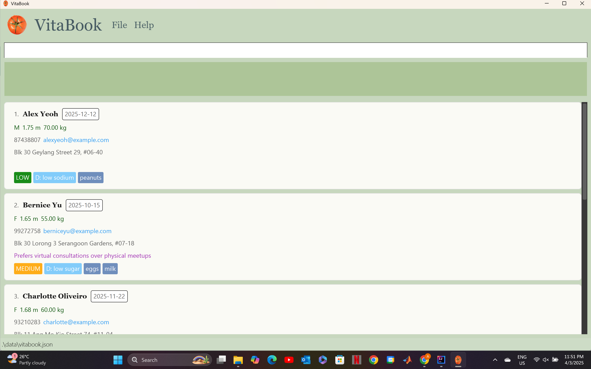
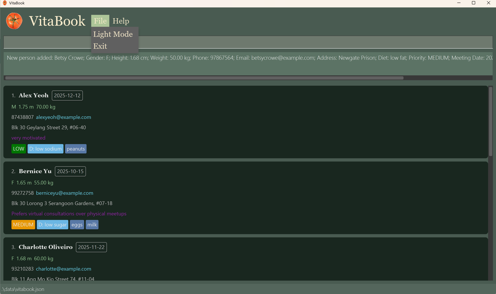

# VitaBook User Guide

**VitaBook** is a **desktop application for freelance nutritionists** to manage patient profiles, dietary information, and follow-ups efficiently. Built for speed and efficiency, VitaBook integrates a powerful **Command Line Interface (CLI)** with a clean **Graphical User Interface (GUI)**, allowing you to quickly retrieve and update patient records while on the go.

### Key Features

- **[Help](#viewing-help--help)** — `help` : View available commands and usage.
- **[Add Patient](#adding-a-patient-add)** — `add` : Add a new patient with full details.
- **[List Patients](#listing-all-patients--list)** — `list` : Show all stored patients.
- **[Edit Patient](#editing-a-patient--edit)** — `edit` : Modify an existing patient’s information.
- **[Remark](#add-a-remark-to-a-patient-remark)** — `remark` : Add or update a note for a patient.
- **[Priority](#changing-a-patients-priority-pr)** - `pr` : Change a patient's priority by index.
- **[Find](#locating-patients-by-name-find)** — `find` : Search for patients by name.
- **[Filter](#filtering-patients-filter)** — `filter` : View patients by diet or priority.
- **[Sort](#sorting-patients-sort)** — `sort` : Sort patients by name, diet, or priority.
- **[Delete](#deleting-a-patient--delete)** — `delete` : Remove a patient by index or email.
- **[History Navigation](#command-history-navigation)** — ↑ ↓ : Cycle through previous commands.
- **[Theme Toggle](#light-mode-and-dark-mode)** — GUI : Switch between dark and light modes.
- **[Clear All](#clearing-all-entries--clear)** — `clear` : Remove all patient data.
- **[Exit](#exiting-the-program--exit)** — `exit` : Quit the application.

[↓ Go to Command Summary](#command-summary)

<page-nav-print />
<!-- * Table of Contents -->
<page-nav-print />

--------------------------------------------------------------------------------------------------------------------

## Quick start

1. Ensure you have Java `17` or above installed in your computer.<br>
   **Mac users:** Ensure you have the precise JDK version prescribed [here](https://se-education.org/guides/tutorials/javaInstallationMac.html).<br>
   To check or install Java, [see Java Setup Instructions](#java-setup-instructions) at the bottom of this guide.

1. Download the latest `.jar` file from [here](https://github.com/AY2425S2-CS2103T-F11-2/tp/releases).

1. Copy the file to the folder you want to use as the _home folder_ for your VitaBook.

1. Open a command terminal, `cd` into the folder you put the jar file in, and use the `java -jar addressbook.jar` command to run the application.<br>
   A GUI similar to the below should appear in a few seconds. Note how the app contains some sample data.<br>
   

1. Type the command in the command box and press Enter to execute it. e.g. typing **`help`** and pressing Enter will open the help window.<br>
   Some example commands you can try:

   * `list` : Lists all patients.

   * `add n/John Doe g/m h/1.78 w/70 no/98765432 e/johnd@example.com a/John Street, block 123, #01-01 d/low sodium m/2025-01-25 pr/low` : Adds a new patient named `John Doe` to the VitaBook.

   * `delete 3` : Deletes the 3rd contact shown in the current list.

   * `clear` : Deletes all contacts.

   * `exit` : Exits the app.

1. Refer to the [Features](#features) below for details of each command.

--------------------------------------------------------------------------------------------------------------------

## Features

<box type="info" seamless>

**Notes about the command format:**<br>

* Command keywords are case-sensitive.<br>
  e.g. `delete 1` is a known command, while `Delete 1` is an unknown command.

* Words in `UPPER_CASE` are the parameters to be supplied by the user.<br>
  e.g. in `add n/NAME`, `NAME` is a parameter which can be used as `add n/John Doe`.

* Items in square brackets are optional.<br>
  e.g `n/NAME [al/ALLERGY]` can be used as `n/John Doe al/friend` or as `n/John Doe`.

* Items with `…`​ after them can be used multiple times including zero times.<br>
  e.g. `[al/ALLERGY]…​` can be used as ` ` (i.e. 0 times), `al/milk`, `al/milk al/peanut` etc.

* Parameters can be in any order.<br>
  e.g. if the command specifies `n/NAME no/PHONE`, `no/PHONE n/NAME` is also acceptable.

* Extraneous parameters for commands that do not take in parameters (such as `help`, `list`, `exit` and `clear`) will be ignored.<br>
  e.g. if the command specifies `help 123`, it will be interpreted as `help`.

* If you are using a PDF version of this document, be careful when copying and pasting commands that span multiple lines as space characters surrounding line-breaks may be omitted when copied over to the application.
</box>

### Viewing help : `help`

Shows a message explaining how to access the help page.


Format: `help`


### Adding a patient: `add`

Adds a new patient to VitaBook with their personal details.

Format: `n/NAME g/GENDER h/HEIGHT w/WEIGHT no/PHONE e/EMAIL a/ADDRESS d/DIET pr/PRIORITY m/MEETING_DATE [al/ALLERGY]…​`

<box type="tip" seamless>

**Tips:**
1. A patient can have any number of allergies (including 0)
1. Emails must be unique i.e. duplicate emails are not allowed.
1. Patient names can be duplicated i.e. duplicate names are allowed.
1. Priority must be one of the following: `high`, `medium`, `low`.
1. Diet must be one of the following: `regular`, `low sodium`, `low fat`, `low carb`, `low sugar`.
</box>

Examples:
* `add n/John Doe g/m h/1.78 w/70 no/98765432 e/johnd@example.com a/John Street, block 123, #01-01 d/low sodium m/2025-01-25 pr/low`
* `add n/Betsy Crowe al/milk e/betsycrowe@example.com g/f a/Newgate Prison h/1.68 w/50 no/97867564 d/low fat al/peanuts m/2025-02-24 pr/medium`

### Listing all patients : `list`

Shows a list of all the patients in VitaBook.

Format: `list`

### Editing a patient : `edit`

Edits the details of an existing patient in VitaBook.

Format: `edit INDEX [n/NAME] [p/PHONE] [e/EMAIL] [a/ADDRESS] [al/ALLERGY]…​`

<box type="tip" seamless>

**Tips:**
1. The index refers to the index number shown in the displayed patient list. The index **must be a positive integer** 1, 2, 3, …​
1. At least one field to edit must be provided.
1. Existing values will be updated to the input values.
1. When editing allergies, the existing allergies of the patient will be removed i.e. adding of allergies is not cumulative.
1. You can remove all the patient’s allergies by typing `al/` without specifying any allergies after it.
1. Priority must be one of the following: `high`, `medium`, `low`.
1. Diet must be one of the following: `regular`, `low sodium`, `low fat`, `low carb`, `low sugar`.
</box>

Examples:
*  `edit 1 no/91234567 e/johndoe@example.com` Edits the phone number and email address of the 1st patient (in the list) to be `91234567` and `johndoe@example.com` respectively.
*  `edit 2 n/Betsy Crower al/` Edits the name of the 2nd patient (in the list) to be `Betsy Crower` and clears all existing allergies.

### Add a remark to a patient: `remark`

Adds a new remark or replaces an existing remark of a patient.

Format: `remark INDEX r/[REMARK]`

<box type="tip" seamless>

**Tips:**
1. You can use this command to add any conditions or custom information.
1. The index refers to the index number shown in the displayed patient list. The index **must be a positive integer** 1, 2, 3, …​
1. You can remove a patient's remark by typing `r/` without specifying any remarks after it.
1. You can add exactly one remark to a patient. e.g. `remark 1 r/needs visual guides r/very motivated` will result in only `very motivated` as a remark to the specified patient.
  
</box>

Examples:
* `list` followed by `remark 2 r/Enjoyed last week's meal plan, keep similar items` adds a remark to the 2nd patient in the patient list.
* `find Betsy` followed by `remark 1 r/Tends to skip meals when stressed` adds a remark to the 1st patient in the results list of the `find` command.
* `remark 3 r/` removes existing remark to the 3rd patient in the list.
### Changing a patient's priority: `pr`

Changes a patient's priority by index.

Format: `pr INDEX PRIORITY`

<box type="tip" seamless>

**Tips:**
1. The index refers to the index number shown in the displayed patient list. The index **must be a positive integer** 1, 2, 3, …​
1. Priority must be one of the following: `high`, `medium`, `low`.
</box>

Examples:
* `pr 1 high` changes the priority of the 1st patient in the patient list to `high`.

### Locating patients by name: `find`

Finds patients whose names contain any of the given keywords.

Format: `find KEYWORD [MORE_KEYWORDS]`

<box type="tip" seamless>

**Tips:**
1. The search is case-insensitive. e.g `hans` will match `Hans`
1. The order of the keywords does not matter. e.g. `Hans Bo` will match `Bo Hans`
1. Only the name is searched.
1. Only full words will be matched e.g. `Han` will not match `Hans`
1. Patients matching at least one keyword will be returned (i.e. `OR` search).
  e.g. `Hans Bo` will return `Hans Gruber`, `Bo Yang`
</box>

Examples:
* `find John` returns `john` and `John Doe`
* `find alex david` returns `Alex Yeoh`, `David Li`<br>
  

### Filtering patients: `filter`

Filter patients based on a field (priority, diet, gender, meeting date).

Format: `filter pr/PRIORITY` or `filter d/DIET` or `filter g/GENDER` or `filter m/MEETING_DATE`

Examples:
* `filter pr/high` returns all patients with high priority.
* `filter d/low sugar` returns all patients with low sugar diet.
* `filter g/f` returns all female patients.
* `filter m/2025-12-12` returns all patients with meeting date on `2025-12-12`.


### Sorting patients: `sort`

Sorts patients based on specific criteria (priority, name, diet).

Format: `sort priority` or `sort name` or `sort diet`

Examples:

* `sort priority` returns patient list sorted from high priority to low priority.
* `sort name` returns patient list sorted in lexicographical (alphabetical) order by name in ascending order.
* `sort diet` returns patient list sorted in lexicographical (alphabetical) order by diet in ascending order.

### Deleting a patient : `delete`

Deletes a patient from VitaBook.

Format: `delete INDEX` or `delete EMAIL`

<box type="tip" seamless>

**Tips:**
* You can choose to delete the patient at the specified `INDEX`.
* Alternatively, you can also delete the patient with a specified `EMAIL`.
* The index refers to the index number shown in the displayed patient list. The index **must be a positive integer** 1, 2, 3, …​
</box>

Examples:
* `list` followed by `delete 2` deletes the 2nd patient in the patient list.
* `find Betsy` followed by `delete 1` deletes the 1st patient in the results list of the `find` command.
* `delete johnd@example.com` deletes the patient with email address `johnd@example.com`.

### Command History Navigation

Use up `↑` and down `↓` arrow keys to navigate previously entered commands.

### Light Mode and Dark Mode

Transition between light mode and dark mode for a more customisable and improved visual experience.

* Click `File` → `Dark Mode` : to change to `Dark Mode`
  
* Click `File` → `Light Mode` : to change to `Light Mode`
  
### Clearing all entries : `clear`

Clears all patient entries from VitaBook.

Format: `clear`

### Exiting the program : `exit`

Exits the program.

Format: `exit`

### Saving the data

VitaBook data are saved in the hard disk automatically after any command that changes the data. There is no need to save manually.

### Editing the data file

VitaBook data are saved automatically as a JSON file `[JAR file location]/data/vitabook.json`. Advanced users are welcome to update data directly by editing that data file.

<box type="warning" seamless>

**Caution:**
If your changes to the data file makes its format invalid, VitaBook will discard all data and start with an empty data file at the next run.  Hence, it is recommended to take a backup of the file before editing it.<br>
Furthermore, certain edits can cause the VitaBook to behave in unexpected ways (e.g., if a value entered is outside the acceptable range). Therefore, edit the data file only if you are confident that you can update it correctly.
</box>

## FAQ

**Q**: What is VitaBook?
**A**: VitaBook is a desktop application designed for freelance nutritionists to manage patient information efficiently
using a typing-preferred interface. It is optimized for fast data entry and offline use.

**Q**: Who is VitaBook for?
**A**: VitaBook is for freelance or home-based nutritionists who need to keep track of patient profiles, dietary
restrictions, medical notes, appointments, and reminders — all from a lightweight CLI app.

**Q**: How is VitaBook different from a regular address book?
**A**: In addition to contact details, VitaBook stores patient-specific information like gender, height, weight,
dietary tags, allergies, priority levels, and meeting dates. It’s tailored to healthcare use cases. It’s optimized for
fast typers, offers structured patient management, and prevents data entry mistakes with input validation.

**Q**: Do I need to install any special software to run VitaBook?
**A**: You just need to have Java 17 installed. No installation is required — simply run the JAR file.

**Q**: What kind of information can I store about a patient?
**A**: You can store:

Name, phone, email, address
Gender, height, weight
Diet  (e.g., low sodium)
Meeting date
Priority level (LOW, MEDIUM, HIGH)
Remarks
Allergy (e.g., peanuts)

**Q**:What happens when I delete a patient?
**A**: All of their information (e.g. diet, priority, meeting date, medical notes) will be permanently deleted from
the address book.

**Q**: Can I undo a mistaken command?
**A**: Yes, you can! Just write undo, followed by the patient index, the field to be changed, and the updated info

**Q**: Can I add custom fields or conditions?
**A**: Any other relevant info other than the fields provided can be added to the remark field as a workaround

**Q**: Can I import data from another app or CSV file?
**A**: Not yet — but you can manually edit the JSON file (data/addressbook.json) to add patients if you're comfortable
with the format.
--------------------------------------------------------------------------------------------------------------------

## Known issues

- **Allergy fields are case-sensitive**
  Adding allergies like `peanuts` and `Peanuts` results in two different allergies being stored. This can lead to duplicates or confusion when filtering/searching.

- **No support for recurring meeting dates or reminders**
  Only a single meeting date (`md/`) can be stored per patient, with no repeat scheduling or notification support.

- **Commands must follow strict prefixes**
  Forgetting a prefix (like `n/`) will result in an invalid command, even if the content is correct.

- **No concurrency or multi-user support**
  VitaBook is designed as a single-user desktop application. Running two instances may cause file conflicts or data loss.

- **No graphical support for charts or health analytics**
  Patient data is presented in text format only. Features like BMI calculation, graphs, or dashboards are not supported.

- **Application crashes if `vitabook.json` is manually corrupted**
  If the user edits or corrupts the storage file manually, VitaBook may fail to start or load a blank state.
- To solve this issue, try deleting vitabook.json and rerunning the application. Remember to backup the file before deleting
-------------------------------------------------------------------------------------------------------------------
[↑ Back to Top](#vitabook-user-guide)
## Command Summary

Action        | Format, Examples
--------------|--------------------------------------------------------------------------------------------------------------------------------------------------------------------------------------------
**Add**       | `add n/NAME g/GENDER h/HEIGHT w/WEIGHT p/PHONE e/EMAIL a/ADDRESS d/DIET pr/PRIORITY md/MEETING_DATE [al/ALLERGY]…`<br>e.g., `add n/Alex Yeoh g/M h/1.75 w/70 p/87438807 e/alex@example.com a/Blk 30 d/low sodium pr/LOW md/2025-12-12 al/peanuts`
**Edit**      | `edit INDEX [n/NAME] [g/GENDER] [h/HEIGHT] [w/WEIGHT] [p/PHONE] [e/EMAIL] [a/ADDRESS] [d/DIET] [pr/PRIORITY] [md/MEETING_DATE] [al/ALLERGY]…`<br>e.g., `edit 1 d/low sugar w/68 pr/MEDIUM`
**Delete**    | `delete INDEX` / `delete EMAIL`<br>e.g., `delete 3` / `delete johnd@gmail.com`
**List**      | `list`
**Find**      | `find KEYWORD [MORE_KEYWORDS]`<br>e.g., `find Alex sugar`
**Filter**    | `filter [PRIORITY] / [DIET] / [GENDER] / [MEETING DATE] `<br>e.g., `filter low sodium`
**Sort**      | `sort [PRIORITY] / [DIET] / [NAME] `<br>e.g., `sort low`
**Priority**  | `pr INDEX PRIORITY`<br>e.g., `pr 2 high`
**Remark**    | `remark INDEX r/REMARK`<br>e.g., `remark 1 r/Likes protein-rich foods`
**Command History** | `Use the arrow keys to navigate to past commands easily`
**Clear**     | `clear`
**Help**      | `help`

--------------------------------------------------------------------------------------------------------------------

## Glossary

**Java 17**
The 17th version of the Java programming language and runtime environment.
Java 17 provides the libraries and tools necessary to run Java applications—such as AB-3.

## Java Setup Instructions

VitaBook requires **Java 17 or higher** to run.

### Check your Java version

Open a terminal or command prompt and run:
```
java -version
```
If Java is installed, you’ll see something like: `java version "17.0.9" 2024-01-16 LTS`
If you see an error or a lower version, install Java 17 using the steps below.

### Install Java 17

[Installation Guide for Windows Users](https://se-education.org/guides/tutorials/javaInstallationWindows.html)<br>
[Installation Guide for Mac Users](https://se-education.org/guides/tutorials/javaInstallationMac.html)<br>
[Installation Guide for Linux Users](https://se-education.org/guides/tutorials/javaInstallationLinux.html)<br>

**JDK (Java Development Kit)**
A complete software development package that includes the Java runtime, compilers, and various tools to develop and run Java applications. Vitabook requires JDK 17 or later. Make sure you install the correct version to ensure compatibility.

**Terminal / Command Line Interface (CLI)**
A text-based interface used to interact with your computer’s operating system. In the terminal, you can navigate between folders and execute commands. To run Vitabook, open your terminal (or Command Prompt/PowerShell on Windows), use the `cd` command to navigate to the folder containing the `vitabook.jar` file, and then type:
```bash
java -jar vitabook.jar
```
[↑ Back to Top](#vitabook-user-guide)<br>
[↑ Go to Quick Start](#quick-start)<br>
